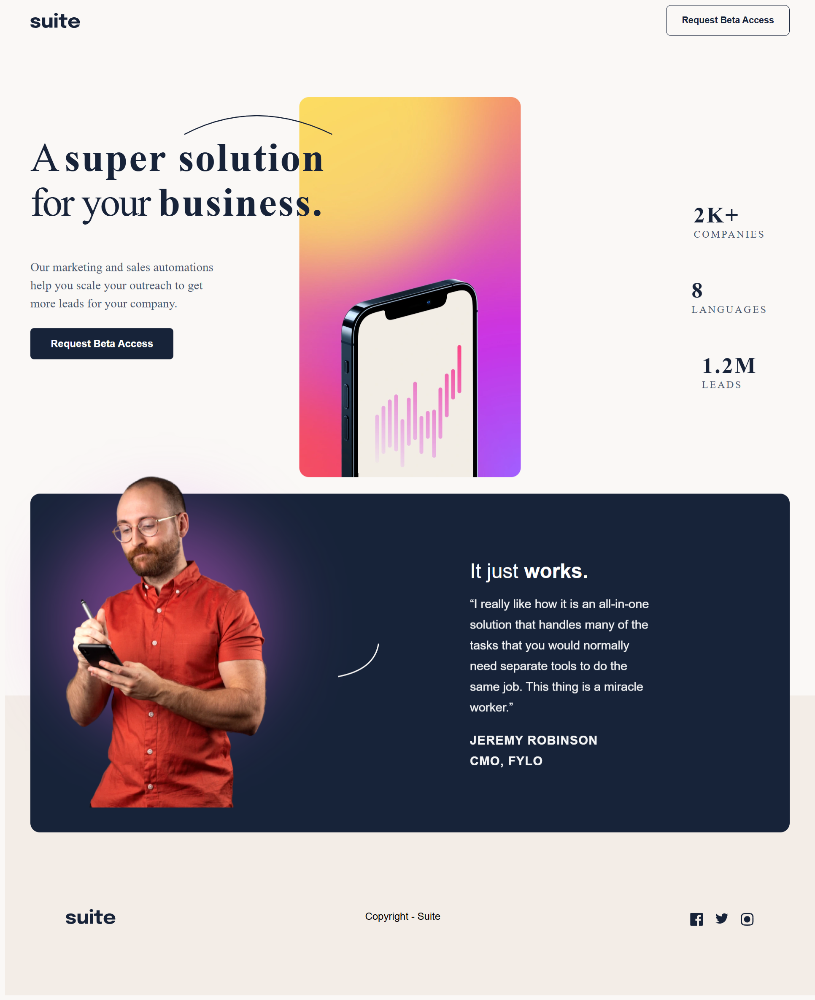
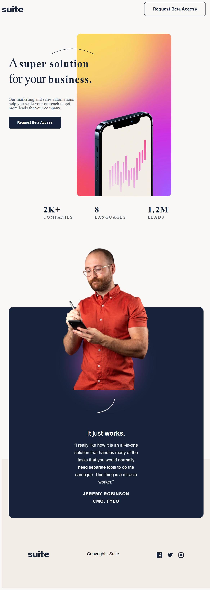
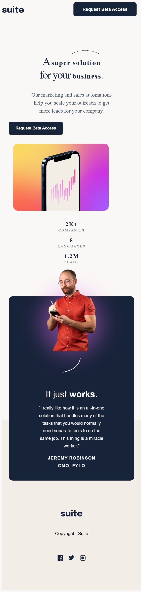

# Frontend Mentor - Suite landing page solution

Ceci est ma solution au défi [Suite landing page sur Frontend Mentor](https://www.frontendmentor.io/challenges/suite-landing-page-tj_eaU-Ra). Les défis de Frontend Mentor m’aident à améliorer mes compétences en HTML et CSS en réalisant des projets concrets basés sur des maquettes professionnelles.

## Table des matières

- [Aperçu](#aperçu)
  - [Le défi](#le-défi)
  - [Capture d’écran](#capture-décran)
  - [Liens](#liens)
- [Mon processus](#mon-processus)
  - [Technologies utilisées](#technologies-utilisées)
  - [Ce que j’ai appris](#ce-que-jai-appris)
  - [Développement futur](#développement-futur)
  - [Ressources utiles](#ressources-utiles)
- [Auteur](#auteur)
- [Remerciements](#remerciements)

## Aperçu

### Le défi

Les utilisateurs doivent pouvoir :

- Voir la disposition optimale selon la taille de l’écran
- Voir les états au survol des éléments interactifs

### Capture d’écran







> ⚠️ Remplace `screenshot.jpg` par une capture réelle de ton site (tu peux utiliser Firefox ou l'outil FireShot).

### Liens

- Code source : [https://github.com/MouhamedSyll22/SUITE-LANDING-PAGE](https://github.com/MouhamedSyll22/SUITE-LANDING-PAGE)
- Site en ligne : [https://mouhamedsyll.github.io/suite-landing-page](https://mouhamedsyll.github.io/suite-landing-page)

## Mon processus

### Technologies utilisées

- HTML5 sémantique
- CSS personnalisé avec variables
- Flexbox
- CSS Grid
- Responsive design avec media queries
- Méthode mobile-first

### Ce que j’ai appris

- J’ai compris l’importance de structurer correctement les sections principales, comme le **hero**, pour un affichage cohérent sur tous les formats.
- J’ai appris à utiliser `clamp()` pour rendre les tailles de police plus adaptatives.
- J’ai amélioré ma logique CSS pour gérer la disposition en **desktop**, **tablette** et **mobile** sans dupliquer les styles.
- J’ai pratiqué l’alignement des contenus et images côte à côte, ainsi que la gestion des espacements.

#### Exemple de code :

```css
.hero__stats {
  display: flex;
  justify-content: space-between;
  gap: 1rem;
}
